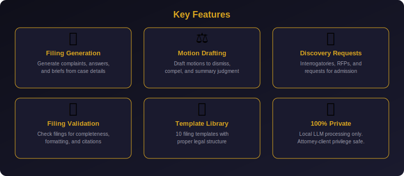

<p align="center">
  
</p>

<p align="center">
  <a href="#features"></a>
  <a href="#privacy--security"></a>
  <a href="#quick-start"></a>
  <a href="#quick-start"></a>
  <a href="#testing"></a>
  <a href="LICENSE"></a>
</p>

<p align="center">
  <strong>🔒 100% Local Processing — No Data Ever Leaves Your Machine</strong><br/>
  <em>Perfect for attorney-client privilege. All AI processing runs on your hardware via Ollama.</em>
</p>

---

# ⚖️ Court Filing Generator

**Project 93** of the [90 Local LLM Projects](../README.md) monorepo.

An AI-powered tool that generates court filings, motions, discovery requests, and legal documents from templates and case details. Built with **Gemma 4** via **Ollama** for complete privacy — no data ever leaves your machine.

> ⚠️ **Legal Disclaimer:** This tool generates DRAFT documents for attorney review only. AI-generated content is NOT legal advice. All documents must be reviewed and approved by a licensed attorney before filing with any court.

---

## 📑 Table of Contents

- [Features](#-features)
- [Architecture](#-architecture)
- [Quick Start](#-quick-start)
- [Docker Deployment](#-docker-deployment)
- [CLI Usage](#-cli-usage)
- [Web UI](#-web-ui)
- [API Documentation](#-api-documentation)
- [Filing Types](#-filing-types)
- [Configuration](#-configuration)
- [Testing](#-testing)
- [Project Structure](#-project-structure)
- [Privacy & Security](#-privacy--security)
- [Legal Disclaimer](#-legal-disclaimer)
- [Contributing](#-contributing)
- [License](#-license)

---

## ✨ Features

<p align="center">
  
</p>

| Feature | Description |
|---------|-------------|
| 📄 **Filing Generation** | Generate complaints, answers, appellate briefs, and more from case details |
| ⚖️ **Motion Drafting** | Draft motions to dismiss, compel, summary judgment, and in limine |
| 🔍 **Discovery Requests** | Create interrogatories, requests for production, and requests for admission |
| ✅ **Filing Validation** | Validate existing filings for completeness, formatting, and citations |
| 📋 **Template Library** | 10 filing templates with proper legal structure and required sections |
| 🔒 **100% Private** | All processing local via Ollama — attorney-client privilege preserved |
| 🖥️ **Multiple Interfaces** | CLI, Web UI (Streamlit), and REST API (FastAPI) |
| 🐳 **Docker Ready** | Full Docker and Docker Compose deployment |
| 📝 **Proper Formatting** | Court captions, numbered paragraphs, signature blocks, certificates of service |

---

## 🏗️ Architecture

<p align="center">
  
</p>

The system is composed of:

1. **Three Interface Layers** — CLI (Click + Rich), Web UI (Streamlit), REST API (FastAPI)
2. **Core Engine** — Filing generation, motion drafting, discovery requests, validation
3. **Template Library** — 10 filing types with proper legal structure
4. **LLM Client** — Shared Ollama client for all LLM interactions
5. **Ollama + Gemma 4** — Local LLM inference engine

All components run locally. No external API calls. No telemetry.

---

## 🚀 Quick Start

### Prerequisites

- **Python 3.10+**
- **Ollama** — [Install Ollama](https://ollama.com/download)
- **Gemma 4** model

### Step 1: Install Ollama and Pull Model

```bash
# Install Ollama (visit https://ollama.com/download for your OS)
# Then pull the model:
ollama pull gemma4
```

### Step 2: Clone and Install

```bash
cd 90-local-llm-projects/93-court-filing-generator

# Install dependencies
pip install -r requirements.txt
```

### Step 3: Start Ollama

```bash
ollama serve
```

### Step 4: Run

```bash
# CLI — List available templates
python -m src.filing_generator.cli templates

# Web UI
streamlit run src/filing_generator/web_ui.py

# REST API
uvicorn src.filing_generator.api:app --host 0.0.0.0 --port 8000
```

---

## 🐳 Docker Deployment

### Build and Run

```bash
# Build the image
docker build -t court-filing-generator .

# Run with Docker Compose (includes Ollama)
docker-compose up -d
```

### Services

| Service | Port | Description |
|---------|------|-------------|
| `app` | 8501 | Streamlit Web UI |
| `api` | 8000 | FastAPI REST API |
| `ollama` | 11434 | Ollama LLM Engine |

```bash
# Pull the model in the Ollama container
docker exec court-filing-generator-ollama ollama pull gemma4

# Access the Web UI
open http://localhost:8501

# Access the API docs
open http://localhost:8000/docs
```

---

## 💻 CLI Usage

The CLI provides full access to all filing generation features with Rich-formatted output.

### List Templates

```bash
python -m src.filing_generator.cli templates
```

Shows all 10 available filing templates with section counts and descriptions.

### Generate a Filing

```bash
python -m src.filing_generator.cli generate \
  --type motion_to_dismiss \
  --case-number "2025-CV-01234" \
  --plaintiff "Jane Doe" \
  --defendant "Acme Corp" \
  --court "United States District Court for the Western District of Texas" \
  --judge "Hon. Maria Rodriguez" \
  --facts "Plaintiff alleges breach of contract..." \
  --arguments "The complaint fails to state a claim under Rule 12(b)(6)..." \
  --output motion_to_dismiss.txt
```

### Generate a Motion

```bash
python -m src.filing_generator.cli motion \
  --type motion_to_compel \
  --case-number "2025-CV-01234" \
  --plaintiff "Jane Doe" \
  --defendant "Acme Corp" \
  --grounds "Defendant failed to respond to First Set of Interrogatories within 30 days..." \
  --output motion_to_compel.txt
```

### Generate Discovery Requests

```bash
python -m src.filing_generator.cli discovery \
  --case-number "2025-CV-01234" \
  --plaintiff "Jane Doe" \
  --defendant "Acme Corp" \
  --discovery-type interrogatories \
  --items "Employment history" \
  --items "Communications regarding the contract" \
  --items "Performance metrics" \
  --output interrogatories.txt
```

### Validate a Filing

```bash
python -m src.filing_generator.cli validate path/to/filing.txt
```

Returns a validation score, issues found, missing sections, and suggestions.

### Show Disclaimer

```bash
python -m src.filing_generator.cli disclaimer
```

---

## 🌐 Web UI

The Streamlit web interface provides an intuitive, browser-based experience with a dark theme and gold legal accents.

```bash
streamlit run src/filing_generator/web_ui.py --server.port 8501
```

### Features

- **4 Tabs:** Generate Filing, Generate Motion, Discovery Request, Validate Filing
- **Case Info Forms:** Enter case number, court, parties, judge, jurisdiction
- **Template Selection:** Choose from 10 filing types with section previews
- **Download Button:** Export generated documents as text files
- **Privacy Badge:** Constant reminder that all processing is local
- **Dark Theme:** Professional legal aesthetic with gold accents

---

## 📡 API Documentation

The FastAPI REST API provides programmatic access to all features.

```bash
uvicorn src.filing_generator.api:app --host 0.0.0.0 --port 8000
```

Interactive API docs at: `http://localhost:8000/docs`

### Endpoints

| Method | Endpoint | Description |
|--------|----------|-------------|
| `GET` | `/health` | Health check (API + Ollama status) |
| `POST` | `/generate` | Generate a court filing |
| `POST` | `/motion` | Generate a legal motion |
| `POST` | `/discovery` | Generate discovery requests |
| `POST` | `/validate` | Validate a filing document |
| `GET` | `/templates` | List all filing templates |

### Example: Generate a Filing

```bash
curl -X POST http://localhost:8000/generate \
  -H "Content-Type: application/json" \
  -d '{
    "filing_type": "motion_to_dismiss",
    "case_info": {
      "case_number": "2025-CV-01234",
      "court": "United States District Court",
      "parties": {"plaintiff": "Jane Doe", "defendant": "Acme Corp"},
      "judge": "Hon. Maria Rodriguez",
      "jurisdiction": "federal"
    },
    "facts": "Plaintiff alleges breach of contract...",
    "arguments": "The complaint fails to state a claim..."
  }'
```

### Example: Generate a Motion

```bash
curl -X POST http://localhost:8000/motion \
  -H "Content-Type: application/json" \
  -d '{
    "motion_type": "motion_to_compel",
    "case_info": {
      "case_number": "2025-CV-01234",
      "court": "United States District Court",
      "parties": {"plaintiff": "Jane Doe", "defendant": "Acme Corp"}
    },
    "grounds": "Defendant failed to respond to discovery requests..."
  }'
```

### Example: Generate Discovery

```bash
curl -X POST http://localhost:8000/discovery \
  -H "Content-Type: application/json" \
  -d '{
    "case_info": {
      "case_number": "2025-CV-01234",
      "court": "United States District Court",
      "parties": {"plaintiff": "Jane Doe", "defendant": "Acme Corp"}
    },
    "discovery_type": "interrogatories",
    "items": ["Employment records", "Contract communications", "Performance data"]
  }'
```

### Example: Validate a Filing

```bash
curl -X POST http://localhost:8000/validate \
  -H "Content-Type: application/json" \
  -d '{
    "filing_text": "IN THE UNITED STATES DISTRICT COURT..."
  }'
```

### Example: Health Check

```bash
curl http://localhost:8000/health
```

```json
{
  "status": "healthy",
  "api": "running",
  "ollama": "connected",
  "privacy": "100% local processing",
  "version": "1.0.0"
}
```

### Example: List Templates

```bash
curl http://localhost:8000/templates
```

---

## 📋 Filing Types

| # | Filing Type | Key | Sections | Use Case |
|---|------------|-----|----------|----------|
| 1 | Motion to Dismiss | `motion_to_dismiss` | 9 | Dismiss case for failure to state a claim (Rule 12(b)) |
| 2 | Motion for Summary Judgment | `motion_for_summary_judgment` | 9 | No genuine dispute of material fact (Rule 56) |
| 3 | Complaint | `complaint` | 8 | Initial pleading setting forth plaintiff's claims |
| 4 | Answer | `answer` | 8 | Defendant's response to the complaint |
| 5 | Motion to Compel | `motion_to_compel` | 10 | Compel opposing party to respond to discovery |
| 6 | Motion in Limine | `motion_in_limine` | 9 | Exclude or include evidence at trial |
| 7 | Subpoena | `subpoena` | 6 | Compel testimony or document production |
| 8 | Discovery Request | `discovery_request` | 6 | Interrogatories, RFPs, or RFAs |
| 9 | Appellate Brief | `appellate_brief` | 12 | Written argument to appellate court |
| 10 | Stipulation | `stipulation` | 5 | Agreement between parties on facts or procedures |

---

## ⚙️ Configuration

### config.yaml

```yaml
app:
  name: "Court Filing Generator"
  version: "1.0.0"

llm:
  model: "gemma4:latest"
  temperature: 0.3      # Low temperature for precise legal language
  max_tokens: 4096
  ollama_host: "http://localhost:11434"

filing:
  default_jurisdiction: "federal"
  default_court: "United States District Court"

logging:
  level: "INFO"
  format: "%(asctime)s - %(name)s - %(levelname)s - %(message)s"
```

### Environment Variables

| Variable | Default | Description |
|----------|---------|-------------|
| `OLLAMA_HOST` | `http://localhost:11434` | Ollama server URL |
| `OLLAMA_MODEL` | `gemma4:latest` | Default LLM model |
| `LOG_LEVEL` | `INFO` | Logging level |
| `DEFAULT_JURISDICTION` | `federal` | Default jurisdiction |
| `DEFAULT_COURT` | `United States District Court` | Default court name |

Environment variables override `config.yaml` settings.

---

## 🧪 Testing

```bash
# Run all tests
python -m pytest tests/ -v

# Run with coverage
python -m pytest tests/ -v --cov=src/filing_generator

# Run specific test class
python -m pytest tests/test_core.py::TestFilingType -v

# Run specific test
python -m pytest tests/test_core.py::TestFormatFilingHeader::test_header_contains_case_number -v
```

### Test Coverage

| Module | Tests | Description |
|--------|-------|-------------|
| `FilingType` | 3 | Enum values, string type, lookup |
| `CaseInfo` | 3 | Creation, parties, defaults |
| `format_filing_header` | 5 | Case number, parties, court, judge, no-judge |
| `_parse_json_response` | 4 | Plain JSON, code fences, embedded, invalid |
| `generate_filing` | 2 | Normal response, raw text fallback |
| `generate_motion` | 1 | Normal response |
| `generate_discovery_request` | 1 | Normal response |
| `validate_filing` | 2 | Normal response, parse failure |
| `FILING_TEMPLATES` | 3 | All types have templates, required keys, sample case |
| `Constants` | 2 | Disclaimer, system prompt |

All LLM-dependent tests use mocks — no Ollama required for testing.

---

## 📁 Project Structure

```
93-court-filing-generator/
├── src/filing_generator/        # Main application package
│   ├── __init__.py              # Package init with version
│   ├── core.py                  # Core filing generation engine
│   ├── cli.py                   # Click CLI with Rich output
│   ├── web_ui.py                # Streamlit web interface
│   ├── api.py                   # FastAPI REST API
│   └── config.py                # Configuration management
├── tests/
│   └── test_core.py             # Comprehensive test suite
├── examples/
│   ├── demo.py                  # Demo script
│   └── README.md                # Examples documentation
├── docs/images/
│   ├── banner.svg               # Project banner
│   ├── architecture.svg         # System architecture diagram
│   └── features.svg             # Feature showcase
├── common/
│   ├── __init__.py              # Common package init
│   └── llm_client.py            # Shared Ollama LLM client
├── .github/workflows/
│   └── ci.yml                   # CI/CD pipeline
├── config.yaml                  # Application configuration
├── setup.py                     # Package setup
├── requirements.txt             # Python dependencies
├── Makefile                     # Build commands
├── Dockerfile                   # Multi-stage Docker build
├── docker-compose.yml           # Full stack deployment
├── .dockerignore                # Docker build ignores
├── .env.example                 # Environment template
├── README.md                    # This file
├── CONTRIBUTING.md              # Contributing guide
└── CHANGELOG.md                 # Version history
```

---

## 🔒 Privacy & Security

This project is built with privacy as a **core design principle**:

| Aspect | Implementation |
|--------|---------------|
| **Data Processing** | 100% local via Ollama — no external API calls |
| **Network** | Zero outbound connections for AI processing |
| **Attorney-Client Privilege** | Preserved — no third-party data exposure |
| **Telemetry** | None — no usage tracking or analytics |
| **Model** | Gemma 4 runs entirely on your hardware |
| **Storage** | All documents stored locally only |
| **Docker** | Isolated containers with no external networking required |

### Why Local LLM Matters for Legal

- **Attorney-client privilege** — Case details never leave your machine
- **Regulatory compliance** — No data residency concerns
- **Confidentiality** — Sensitive case facts stay private
- **Audit trail** — Complete control over data lifecycle
- **No vendor lock-in** — Your data, your infrastructure

---

## ⚠️ Legal Disclaimer

```
╔══════════════════════════════════════════════════════════════════════════════╗
║                            LEGAL DISCLAIMER                                ║
╠══════════════════════════════════════════════════════════════════════════════╣
║ This tool generates DRAFT legal documents using AI. All output is for      ║
║ informational and drafting assistance purposes ONLY.                       ║
║                                                                            ║
║ • Documents MUST be reviewed by a licensed attorney before filing          ║
║ • AI-generated content may contain errors or omissions                     ║
║ • Local rules and jurisdiction-specific requirements must be verified      ║
║ • This tool does NOT constitute legal advice                               ║
║ • The user assumes all responsibility for filed documents                  ║
╚══════════════════════════════════════════════════════════════════════════════╝
```

---

## 🤝 Contributing

Contributions are welcome! Please see [CONTRIBUTING.md](CONTRIBUTING.md) for guidelines.

1. Fork the repository
2. Create a feature branch
3. Make your changes with tests
4. Submit a Pull Request

---

## 📄 License

This project is part of the [90 Local LLM Projects](../README.md) monorepo and is available under the MIT License.

---

<p align="center">
  <strong>⚖️ Court Filing Generator</strong><br/>
  <em>AI-Powered Legal Document Drafting — 100% Private</em><br/><br/>
  <a href="#-quick-start">Quick Start</a> •
  <a href="#-cli-usage">CLI</a> •
  <a href="#-web-ui">Web UI</a> •
  <a href="#-api-documentation">API</a> •
  <a href="#-filing-types">Filing Types</a>
</p>
